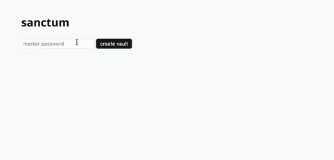

# Sanctum

**Sanctum** is a lightweight password manager built with Go (Echo) and HTMX. It focuses on encryption, minimal dependencies, and a clean, responsive interface—without relying on JavaScript frameworks.

It was built as a way to **learn Go and HTMX** by creating something practical, secure, and usable. While best efforts were made to handle sensitive data responsibly, **I’m not a cryptography expert**—so this is NOT recommended for production use without proper auditing.

## How does it work?

Sanctum stores all password data in a **SQLite database**, where each entry includes an **encrypted password**, **username**, **site**, **notes**, **timestamp**, and a **per-entry nonce** (used as an IV for encryption).

When the user first starts the app, they are asked to set or enter a **master password**. This password is **hashed using bcrypt** for authentication and stored alongside a randomly generated **salt**. To encrypt and decrypt passwords, Sanctum derives a **32-byte encryption key** from the master password using **scrypt**, which makes brute-force attacks **computationally expensive**.

Passwords are encrypted using **AES-GCM** with a fresh **12-byte nonce** for each entry. The result is stored in **base64** along with its **nonce**. Decryption uses the same derived key and nonce to safely recover the original password.

The derived key is kept in memory during the session and discarded on **server shutdown**. No raw passwords or keys are ever written to disk.

## Authentication

Sanctum uses a **token-based authentication** system. On login, the server generates **32 random bytes**, encodes them as a **base64 token**, and sends it to the client in a **secure cookie**. A **SHA-256 hash** of this token is stored in the **database**. On each request, the server **rehashes** the token from the cookie and compares it to the stored hash. If they match, the session is valid. Tokens are **invalidated** by deleting the hash and clearing the cookie, ensuring simple and secure stateless auth.

## Why HTMX?

HTMX lets the backend stay in control of rendering and state, while still delivering a smooth, interactive user experience. It avoids the complexity of JavaScript frameworks, and keeps logic and security server-side—ideal for apps like Sanctum where minimizing frontend surface area is a feature, not a limitation.

> "HTMX gives you the power of modern frontend interactivity without the complexity of SPAs." 
> — [HTMX is the Future](https://quii.dev/HTMX_is_the_Future)